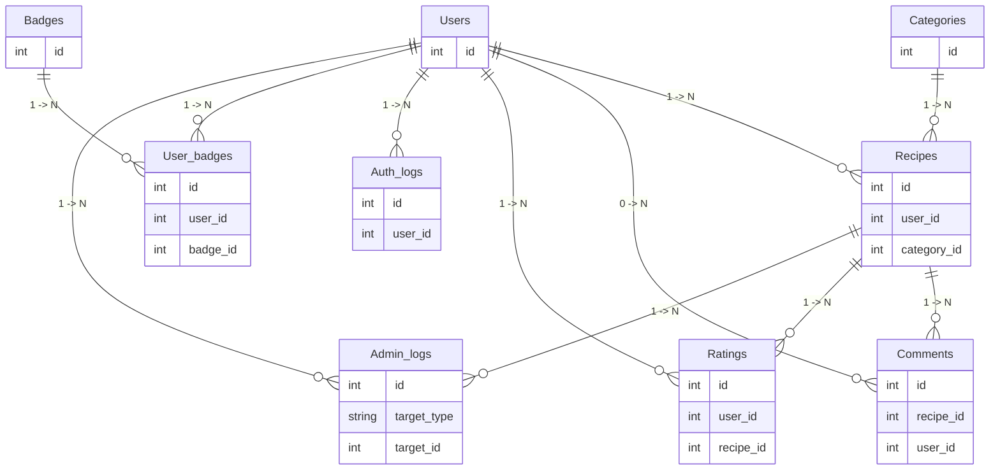

```mermaid

erDiagram
    Users ||--o{ Recipes : "1 -> N"
    Users ||--o{ Comments : "0 -> N"
    Users ||--o{ Ratings : "1 -> N"
    Users ||--o{ Auth_logs : "1 -> N"
    Users ||--o{ User_badges : "1 -> N"
    Users ||--o{ Admin_logs : "1 -> N"

    Categories ||--o{ Recipes : "1 -> N"

    Recipes ||--o{ Comments : "1 -> N"
    Recipes ||--o{ Ratings : "1 -> N"
    Recipes ||--o{ Admin_logs : "1 -> N"

    Badges ||--o{ User_badges : "1 -> N"

    Users {
        int id
    }

    Recipes {
        int id
        int user_id
        int category_id
    }

    Categories {
        int id
    }

    Comments {
        int id
        int recipe_id
        int user_id
    }

    Ratings {
        int id
        int user_id
        int recipe_id
    }

    Admin_logs {
        int id
        string target_type
        int target_id
    }

    Auth_logs {
        int id
        int user_id
    }

    User_badges {
        int id
        int user_id
        int badge_id
    }

    Badges {
        int id
    }
```